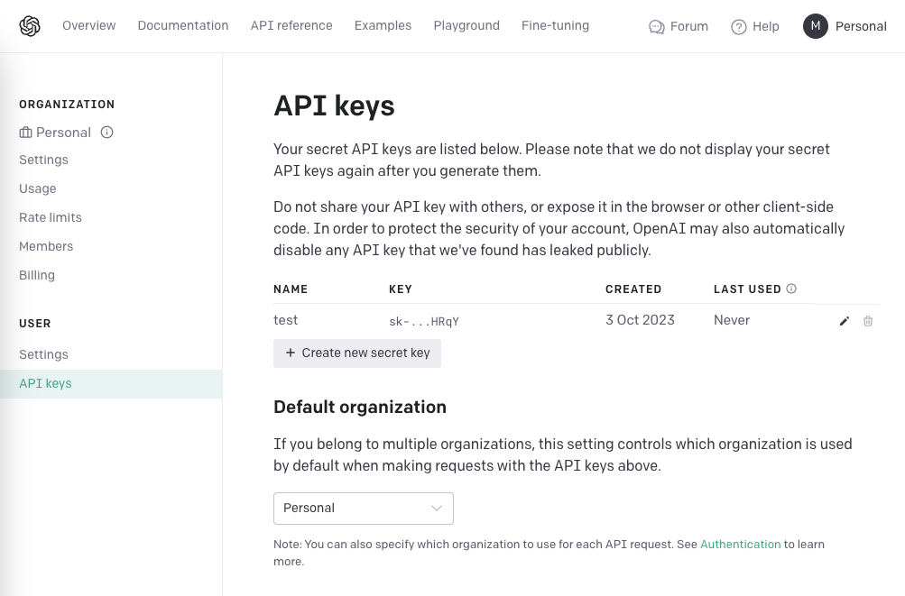

# 🌐 Integrate OpenAI with Google Search using LangChain

Delve into a real-world example showcasing the power of LangChain to create AI-driven agents. 

Through this guide, we'll harness the potential of OpenAI's LLM and seamlessly integrate it with Google Search using the LangChain library.

---

## 🚀 Quickstart Guide

### 1. Acquire an OpenAI API Key

To host and run the Web App on your local browser, you first need a valid OpenAI API Key. Here's how you can get one:

1. Navigate to OpenAI's official platform at [platform.openai.com](https://platform.openai.com) and sign in.
2. Tap on your profile icon located at the top-right corner and opt for "View API Keys".
3. Hit the "Create New Secret Key" option to generate a fresh API key.
4. Label your API key appropriately and finalize by clicking "Create secret key".
5. Safely store your API key.

    

🔐 **Safety Precautions**

- Treat your API key as confidential. Unauthorized access to your key can compromise your OpenAI account and resources.
  
- Collaborate with your key only on platforms you trust.

- Employ distinct API keys for varying services to monitor your usage and detect any potential breaches.

- Make it a habit to assess your API key activities and retire those that aren't active.

### 2. Acquire an SerpApi API Key

SerpApi, the Google Search Results API, offers developers a streamlined approach to access and interact with Google search outcomes.

To tap into SerpApi's offerings, you'll need its API key. Here's how:

Visit [serpapi.com](https://www.serpapi.com/), register for a free test account, and collect your API key from the dashboard.

### 3. Setting Up the Repository

1. Clone the repository onto your system.
2. Rename the ".env_example" file to ".env". Input both your OpenAI API and SerpApi Keys, replacing the placeholders.

### 4. Preparing the Environment

1. Establish a new Python virtual environment. Execute this command in your terminal:

```bash
python3 -m venv env
```

**Note**: Virtual environments are Python's answer to dependency management. They allow project-specific dependency installations, ensuring there's no conflict with global Python installations or other projects.

2. Activate the virtual environment by executing the following command in the terminal:

```bash
source env/bin/activate
```

3. Using the requirements.txt file as a reference, install all essential Python libraries for this project:

```bash
pip install -r requirements.txt
```

### 5. Launch the application

Get the application up and running with:

```bash
python app.py
```